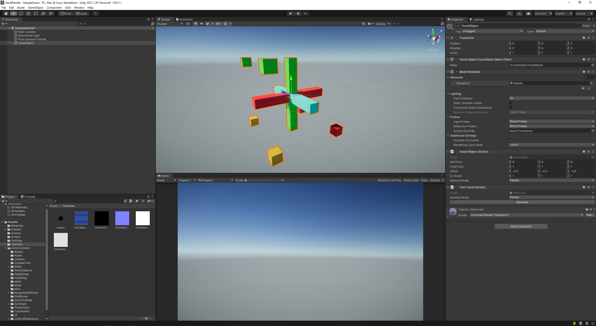

# Voxel Tests

This is a test application for my voxel experiments. 

Main code for the voxel stuff resides on the UnityCommon submodule, this is just
the test framework.

## Tech stuff

* Code is not optimized for speed, wanted it to be quick to develop and simple to understand.
* VoxelObject contains the voxel data and can generate the mesh.
* There are two ways to generate the mesh, based on the materialMode property:
  * Mode = Palette: Only one material is needed, but it should have a 16x16 texture containing the colors for each of the possible 256 values on the voxel data
  * Mode = Multi: One material is necessary per value of the voxel data
* Check the VoxelTest behaviour for some simple generation

## Credits

* Code, art, game design done by Diogo de Andrade

## Licenses

All code in this repo is made available through the [GPLv3] license.
The text and all the other files are made available through the 
[CC BY-NC-SA 4.0] license.

## Metadata

* Autor: [Diogo Andrade][]

[Diogo Andrade]:https://github.com/DiogoDeAndrade
[GPLv3]:https://www.gnu.org/licenses/gpl-3.0.en.html
[CC-BY-SA 3.0.]:http://creativecommons.org/licenses/by-sa/3.0/
[CC BY-NC-SA 4.0]:https://creativecommons.org/licenses/by-nc-sa/4.0/
[Bfxr]:https://www.bfxr.net/
[Universal LPC Spritesheet Character Generator]:https://sanderfrenken.github.io/Universal-LPC-Spritesheet-Character-Generator/
[Universal LPC Spritesheet Unity Importer]:https://github.com/bitcula/Universal-LPC-Spritesheet-Unity-Importer
[Generate Random Cave Levels Using Cellular Automata]:https://gamedevelopment.tutsplus.com/tutorials/generate-random-cave-levels-using-cellular-automata--gamedev-9664
